# 🎯 Cyber Risk Assessment AI Scoring System
## Visual Diagrams (Mermaid)

**Version**: 1.1 | **Date**: May 6, 2026

---

## 📊 Database Entity Relationship Diagram

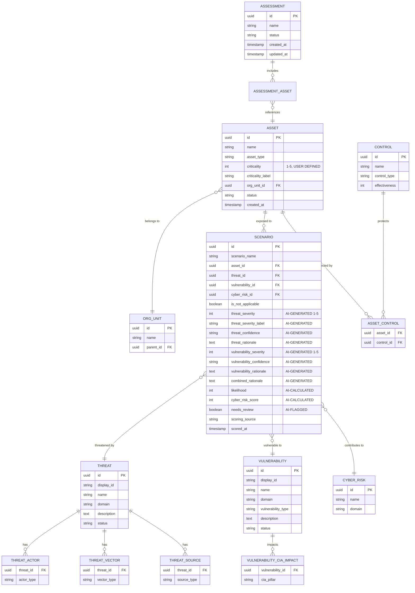

---

## 🔄 Data Flow Architecture

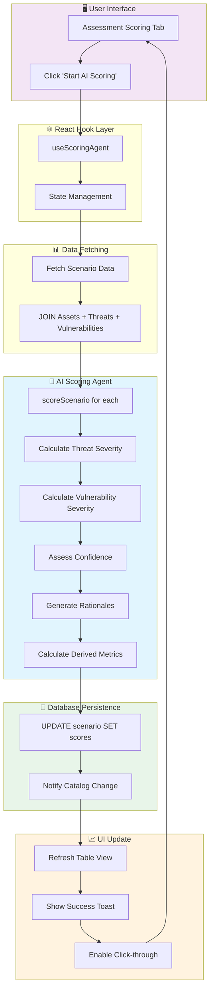

---

## 🧮 Risk Scoring Formula

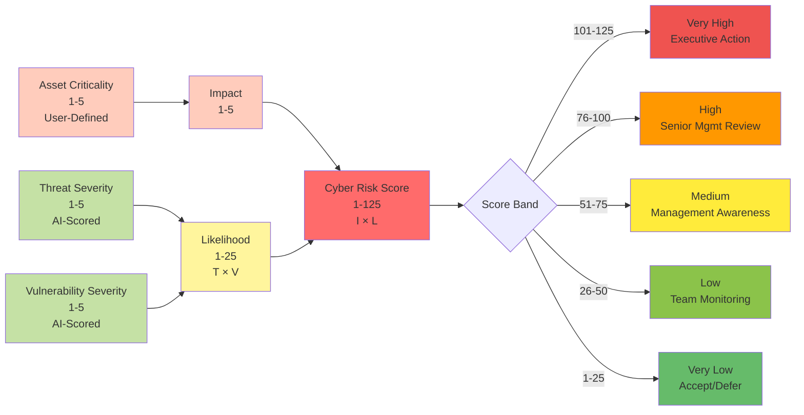

---

## 🎯 Threat Severity Calculation Flow

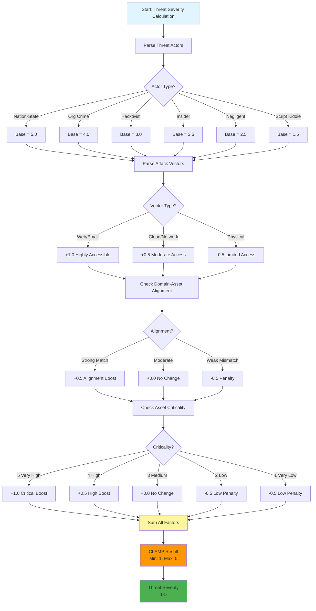

---

## 🛡️ Vulnerability Severity Calculation Flow

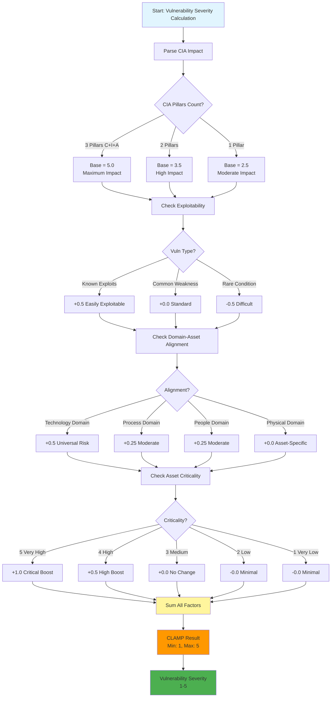

---

## 🔍 Confidence Assessment Logic

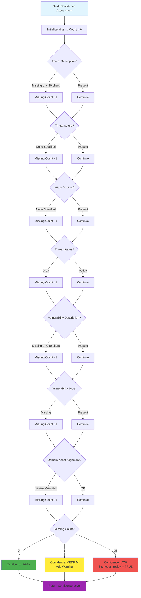

---

## 📈 Batch Processing Flow

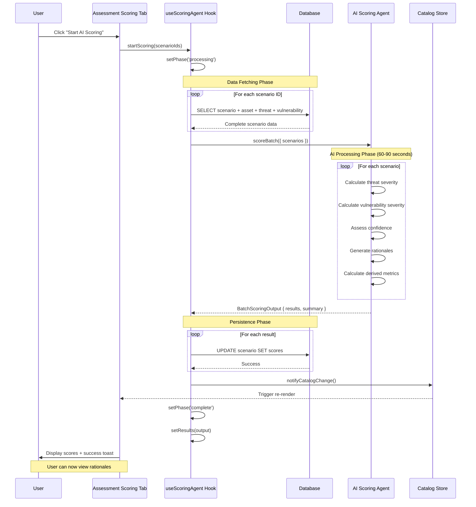

---

## 🎨 UI State Machine

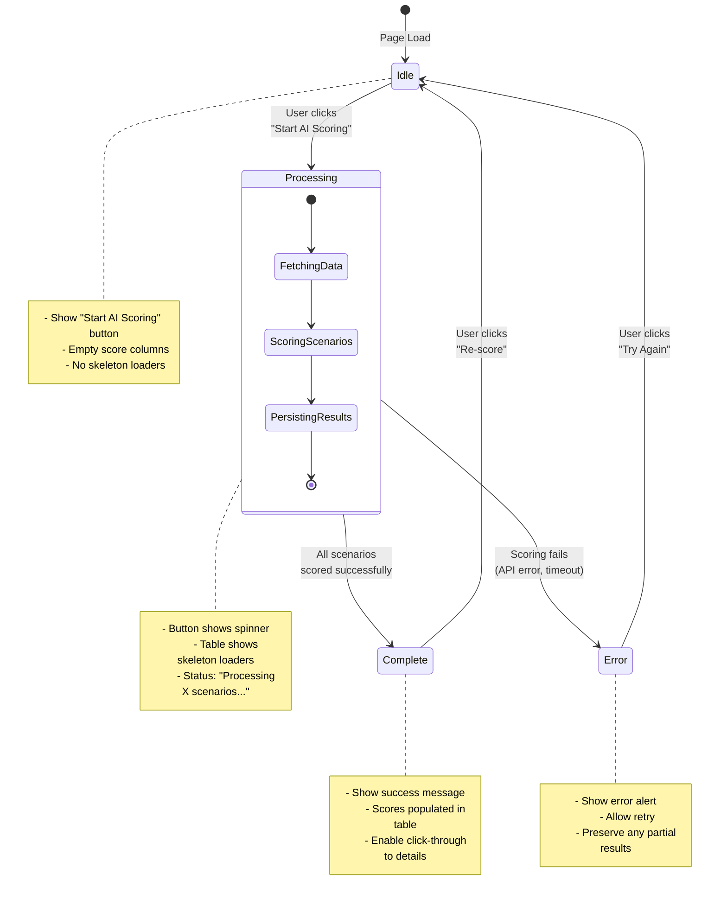

---

## 🏗️ Component Architecture

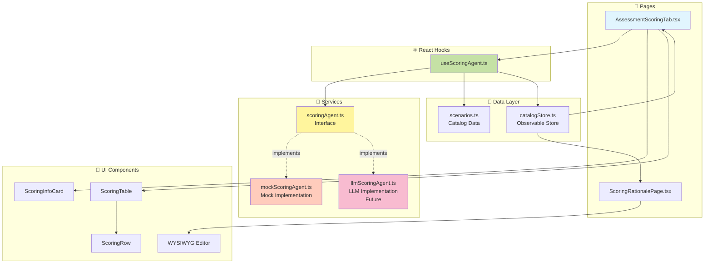

---

## 📊 Severity Distribution Example

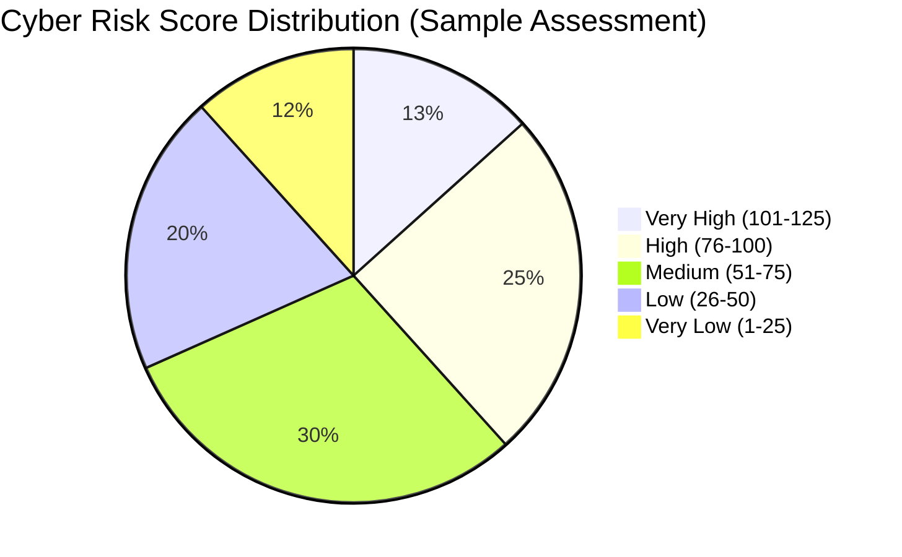

---

## ⏱️ Performance Comparison

```mermaid
gantt
    title Time Comparison: Manual vs AI Scoring (50 scenarios)
    dateFormat X
    axisFormat %s

    section Manual Scoring
    Analyst reviews scenarios :0, 14400
    Analyst writes rationales :14400, 28800

    section AI Scoring
    AI processes all scenarios :0, 75
    UI updates :75, 76
```

---

## 🔄 Scoring Workflow

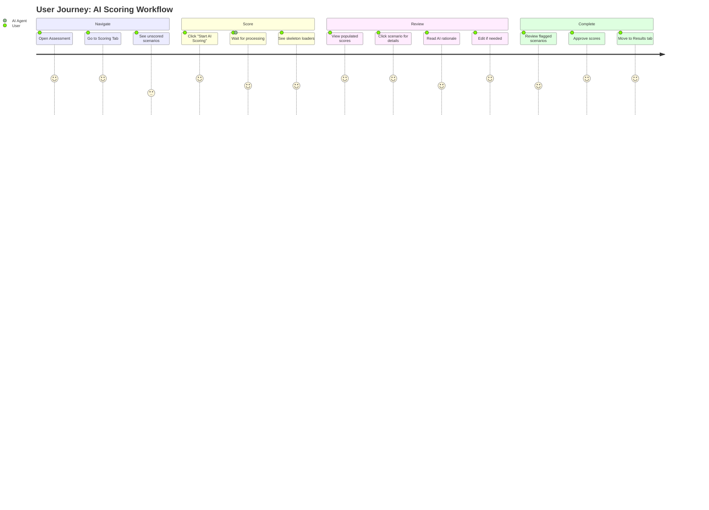

---

## 🎯 Confidence Level Distribution

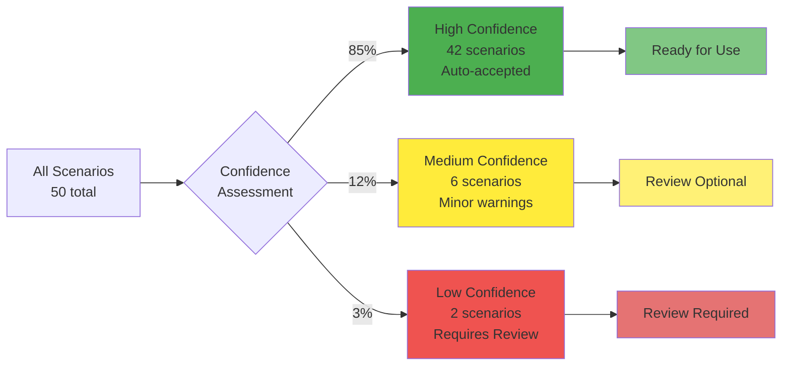

---

## 🔐 Data Security & Audit Trail

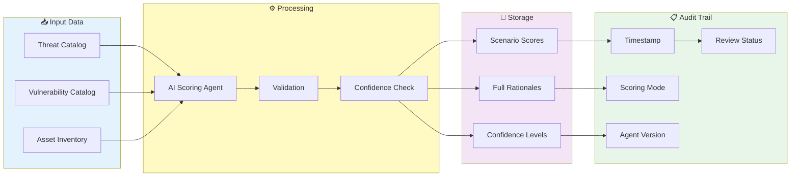

---

## 📱 Responsive UI Layout

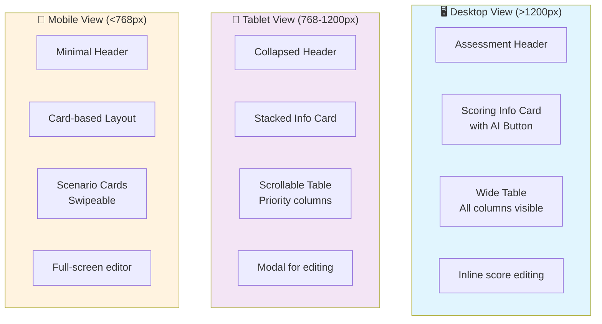

---

**End of Diagrams**

## 💡 How to Use These Diagrams

### In GitHub/GitLab
These Mermaid diagrams render automatically in:
- GitHub README.md files
- GitLab markdown files
- Most modern markdown viewers

### In Documentation Tools
- **Docusaurus**: Native Mermaid support
- **MkDocs**: Use `mkdocs-mermaid2-plugin`
- **Confluence**: Use Mermaid macro or export as PNG

### Export as Images
Use one of these tools:
1. **Mermaid Live Editor**: https://mermaid.live
2. **VS Code**: Markdown Preview Mermaid Support extension
3. **CLI**: `mmdc -i input.md -o output.png`

### In Presentations
1. Export diagrams as PNG/SVG
2. Import into PowerPoint/Keynote
3. Or use Marp for markdown slides

---

**Document Version**: 1.0  
**Last Updated**: May 6, 2026  
**Format**: Mermaid Diagrams  
**Compatibility**: GitHub, GitLab, Docusaurus, MkDocs
