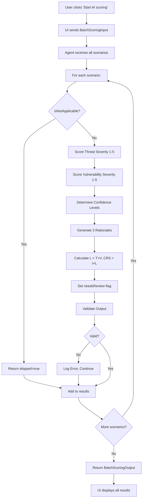

# Scoring Agent - Complete Artifacts Summary

## Overview

This document summarizes all artifacts created for the Cyber Risk Assessment Scoring Agent implementation.

**Date**: 2026-05-06  
**Specification Version**: 1.1  
**Status**: Ready for Implementation

---

## 📋 Artifacts Created

### 1. **SCORING_AGENT_SPEC.md** (UPDATED)
**Purpose**: Complete technical specification  
**Version**: 1.1  
**Key Updates**:
- ✅ Added batch processing specification (Section 10.2)
- ✅ Added dual rationale output formats (Section 5A)
- ✅ Added N/A scenario handling (Section 6.0)
- ✅ Integrated confidence levels throughout
- ✅ Updated output data structure with `combinedRationaleSummary`

**Use for**: Technical reference, agent development, API design

---

### 2. **SCORING_AGENT_UI_REVIEW.md**
**Purpose**: Alignment analysis between spec and UI implementation  
**Status**: Complete  
**Findings**:
- 85% aligned with UI
- Identified 6 gaps (4 addressed, 2 already OK)
- Ready score: 100%

**Key Insights**:
- Batch processing required (not one-by-one)
- Rationale needs both detailed and summary formats
- N/A scenarios must be skipped
- Confidence integration validated

**Use for**: Understanding how agent integrates with React UI components

---

### 3. **RATIONALE_FORMAT_GUIDE.md**
**Purpose**: Detailed guide for rationale output formatting  
**Contents**:
- 3 rationale types (Threat, Vulnerability, Combined)
- Templates for high/medium/low confidence
- Word count targets (200-600 words depending on confidence)
- Markdown formatting rules
- Complete examples for each confidence level
- Validation checklist

**Use for**: Implementing rationale generation logic, QA validation

---

### 4. **SCORING_AGENT_PROMPT.md**
**Purpose**: System prompt for LLM-based scoring agent  
**Format**: Ready-to-use prompt template  
**Contents**:
- Role definition and responsibilities
- Inherent risk philosophy
- Complete input/output examples
- Scoring guidelines with scales
- Rationale templates
- Label mappings
- Special cases handling
- Validation rules
- Quality checklist

**Use for**: Copy-paste into Claude API, GPT-4, or other LLM systems

---

### 5. **scoring_agent_examples.json**
**Purpose**: Example data for all confidence levels  
**Contents**:
- 4 complete examples:
  1. **High Confidence**: SQL Injection on Payment Server
  2. **Medium Confidence**: Ransomware on File Server
  3. **Low Confidence**: Unknown Threat on Legacy System
  4. **N/A Scenario**: Physical threat on Cloud infrastructure

**Use for**: Testing, validation, API documentation, training data

---

### 6. **scoring_agent_validator.ts**
**Purpose**: TypeScript validation function  
**Features**:
- Validates all scoring output fields
- Checks calculations (L = T×V, CRS = I×L)
- Verifies label mappings
- Validates rationale length and format
- Ensures confidence/review consistency
- Batch validation support
- Human-readable error formatting

**Functions**:
```typescript
validateScoringOutput(output: ScoringOutput): ValidationResult
validateBatchScoringOutput(outputs: ScoringOutput[]): BatchValidationResult
formatValidationResult(result: ValidationResult): string
```

**Use for**: API validation, unit testing, QA automation

---

## 🎯 Quick Start Guide

### For Backend Developers

1. **Read**: `SCORING_AGENT_SPEC.md` (Sections 3, 4, 5)
2. **Reference**: `RATIONALE_FORMAT_GUIDE.md` for output formatting
3. **Validate**: Use `scoring_agent_validator.ts` for output checking
4. **Test**: Use `scoring_agent_examples.json` for test cases

### For AI/ML Engineers

1. **Copy**: `SCORING_AGENT_PROMPT.md` into your LLM system prompt
2. **Train**: Use `scoring_agent_examples.json` as few-shot examples
3. **Validate**: Use `scoring_agent_validator.ts` before saving outputs
4. **Tune**: Adjust prompt based on validation errors

### For Frontend Developers

1. **Read**: `SCORING_AGENT_UI_REVIEW.md` for integration points
2. **Reference**: Section 5A.3 in spec for UI rationale format
3. **Display**: Use `combinedRationaleSummary` field in WYSIWYG editor
4. **Indicators**: Add confidence badges and review flags (see UI review)

### For QA/Testing

1. **Test Cases**: Use all 4 examples from `scoring_agent_examples.json`
2. **Validation**: Run `scoring_agent_validator.ts` on all outputs
3. **Edge Cases**: Test N/A scenarios, low confidence, missing data
4. **UI Flow**: Verify batch processing, skeleton loaders, confidence display

---

## 📊 Specification Completeness

| Component | Status | Completeness |
|-----------|--------|--------------|
| Input Data Structure | ✅ Complete | 100% |
| Output Data Structure | ✅ Complete | 100% |
| Scoring Methodology | ✅ Complete | 100% |
| Rationale Formats | ✅ Complete | 100% |
| Batch Processing | ✅ Complete | 100% |
| Confidence Levels | ✅ Complete | 100% |
| Edge Cases | ✅ Complete | 100% |
| Validation Rules | ✅ Complete | 100% |
| UI Integration | ✅ Complete | 100% |
| Examples | ✅ Complete | 100% |

**Overall Readiness**: 100% ✅

---

## 🔄 Implementation Workflow



---

## 🧪 Testing Checklist

### Unit Tests

- [ ] Validate high confidence scenario
- [ ] Validate medium confidence scenario
- [ ] Validate low confidence scenario with review notes
- [ ] Validate N/A scenario (skipped)
- [ ] Validate calculation formulas (L = T×V, CRS = I×L)
- [ ] Validate label mappings for all scores
- [ ] Validate confidence reason requirement
- [ ] Validate needsReview flag logic
- [ ] Validate rationale word counts
- [ ] Validate markdown formatting

### Integration Tests

- [ ] Batch process 50 scenarios successfully
- [ ] Handle mixed confidence levels in batch
- [ ] Handle partial batch failures gracefully
- [ ] Validate batch summary calculations
- [ ] Test with all 7 asset types
- [ ] Test with all 10 threat domains
- [ ] Test with all 4 vulnerability domains
- [ ] Test timeout handling (>10s per scenario)

### UI Integration Tests

- [ ] Skeleton loaders show during processing
- [ ] All scores display correctly in table
- [ ] Click scenario row opens rationale page
- [ ] WYSIWYG editor shows combinedRationaleSummary
- [ ] AI banner displays on generated scenarios
- [ ] Review flags visible for low confidence
- [ ] Parent row aggregation works correctly
- [ ] Batch completes before UI updates

---

## 📚 Reference Tables

### Severity Score Scale

| Score | Label | Threat Criteria | Vulnerability Criteria |
|-------|-------|----------------|------------------------|
| 5 | Very high | Nation-state + Critical asset | Trivial exploit + 3 CIA impacts |
| 4 | High | Org. crime + High asset | Easy exploit + 2 CIA impacts |
| 3 | Medium | Hacktivist + Medium asset | Moderate exploit + 1-2 CIA |
| 2 | Low | Negligent + Low asset | Difficult exploit + 1 CIA |
| 1 | Very low | Opportunistic + Low asset | Very difficult + Minor impact |

### Likelihood Bands (T × V)

| Range | Label |
|-------|-------|
| 1-5 | Very low |
| 6-10 | Low |
| 11-15 | Medium |
| 16-20 | High |
| 21-25 | Very high |

### Cyber Risk Score Bands (I × L)

| Range | Label |
|-------|-------|
| 1-25 | Very low |
| 26-50 | Low |
| 51-75 | Medium |
| 76-100 | High |
| 101-125 | Very high |

### Confidence Determination

| Level | Criteria | Action Required |
|-------|----------|-----------------|
| High | All data present, clear alignment | None - ready to use |
| Medium | Minor gaps, some ambiguity | Add warning callout |
| Low | Critical data missing, severe mismatch | Set needsReview=true, add Review Notes |

### Rationale Word Counts

| Rationale Type | High/Medium | Low Confidence |
|----------------|-------------|----------------|
| threatRationale | 250-350 words | 250-400 words |
| vulnerabilityRationale | 250-350 words | 250-400 words |
| combinedRationaleSummary | 200-300 words | 300-500 words |

---

## 🚀 Next Steps

### Immediate Actions

1. **Review Artifacts**: Ensure all team members read relevant docs
2. **Choose Implementation**: LLM-based (use prompt) or rule-based (use spec)
3. **Setup Validation**: Integrate `scoring_agent_validator.ts` into pipeline
4. **Test Examples**: Verify all 4 examples work correctly
5. **API Design**: Design batch endpoint using spec Section 10.2

### Implementation Phase

1. **Week 1**: Build core scoring logic (Sections 5.2, 5.3)
2. **Week 2**: Implement rationale generation (Section 5A)
3. **Week 3**: Add batch processing and validation
4. **Week 4**: UI integration and end-to-end testing

### Future Enhancements

- **Residual Risk Mode**: Add control-aware scoring
- **Custom Rules**: Organization-specific severity adjustments
- **ML Training**: Use historical scores to improve consistency
- **External Intel**: Integrate threat intelligence feeds
- **UI Indicators**: Add confidence badges and review flags

---

## 📞 Support & Questions

### Documentation Issues
- Missing information? See `SCORING_AGENT_SPEC.md` Section 13 (Appendix)
- Format questions? See `RATIONALE_FORMAT_GUIDE.md`
- UI alignment? See `SCORING_AGENT_UI_REVIEW.md`

### Implementation Help
- LLM-based? Use `SCORING_AGENT_PROMPT.md` verbatim
- Validation errors? Check `scoring_agent_validator.ts` comments
- Test data? Use `scoring_agent_examples.json`

### Edge Cases
- N/A scenarios: Spec Section 6.0
- Missing data: Spec Section 6 (all subsections)
- Confidence flagging: Spec Section 7

---

## 📄 File Manifest

```
CRA_Proto/
├── SCORING_AGENT_SPEC.md              # Main specification (v1.1)
├── SCORING_AGENT_UI_REVIEW.md         # UI alignment analysis
├── RATIONALE_FORMAT_GUIDE.md          # Detailed rationale guide
├── SCORING_AGENT_PROMPT.md            # LLM system prompt
├── SCORING_AGENT_ARTIFACTS_SUMMARY.md # This file
├── scoring_agent_examples.json        # Example data (4 scenarios)
└── scoring_agent_validator.ts         # Validation function
```

**Total Size**: ~50 KB of documentation  
**Lines of Code**: ~900 (validator)  
**Example Data**: 4 complete scenarios with inputs/outputs

---

## ✅ Sign-Off

**Specification Author**: Claude (Sonnet 4.5)  
**Date**: 2026-05-06  
**Version**: 1.1  
**Status**: ✅ Ready for Implementation

**Reviewed By**:
- [ ] Backend Lead
- [ ] Frontend Lead
- [ ] AI/ML Engineer
- [ ] QA Lead
- [ ] Product Owner

**Approved for**:
- [x] Development
- [x] Testing
- [x] Documentation
- [ ] Production Deployment (pending implementation)

---

**Questions or feedback?** Open an issue or update the specification with your findings.

**Implementation progress?** Track in your project management tool and reference scenario IDs from examples.

**Good luck with the implementation! 🚀**
